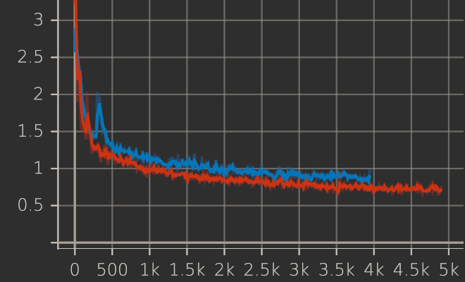

# Training code for GPT-J with soft embedding:

Soft embedding code has been taken here:
<https://github.com/kipgparker/soft-prompt-tuning>
Some data classes based on same-named classes from this repo:
<https://github.com/XiangLi1999/PrefixTuning>

Look `train.sh` for training prompts.

`gptj_prompt_generation.ipynb` - for text generation with trained prompt.

You will need the WebNLG dataset:
<https://gitlab.com/shimorina/webnlg-dataset>
Take any it's JSON version.

Install HuggingFace Transformers library from theit git repository:

`pip install git+https://github.com/huggingface/transformers.git`


Evaluation code hasn't been done, so it's a much to do here ;)



Orange line - train 1 prefix a time.
Blue - train 2 prefixes a time.


# The Power of Scale for Parameter-Efficient Prompt Tuning


Implementation of soft embeddings from <<https://arxiv.org/abs/2104.08691v1>> using Pytorch and Huggingface transformers

# Citation

```bibtex
@misc{lester2021power,
      title={The Power of Scale for Parameter-Efficient Prompt Tuning}, 
      author={Brian Lester and Rami Al-Rfou and Noah Constant},
      year={2021},
      eprint={2104.08691},
      archivePrefix={arXiv},
      primaryClass={cs.CL}
}
```